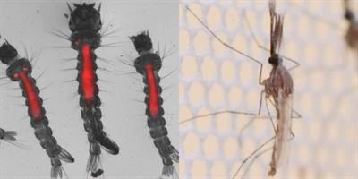

As students or ordinary citizens, we may often wonder what contribution we can make to solving health problems that far exceed our sphere of influence. In this article, I discuss how a group of students from a biology department was able to turn a question into action within their university

[{fig-align="left"}](https://www.frontiersin.org/research-topics/13719/microbiota-a-consequential-third-wheel-in-the-mosquito-pathogen-relationship/magazine)

## From a Bachelor’s thesis to a public health issue.

June 2022, we had just completed 6-month internship on our Bachelor’s research projects in medical entomology. After defending our thesis, we realized that we had all cited the same alarming statistic: “249 million cases of malaria in 2022 and 610,000 deaths.” The question our advisor, Dr. Filemon TOKPONNON, asked me was simple: “Right now, what do you think you can do as students to fight malaria in your communities?”

## An Idea, Human Resources, but No Funding.

After gathering a group of classmates and discussing the matter with them, we decided to take advantage of World Malaria Day in 2023 to organize a public science outreach event on malaria, the leading cause of mortality and morbidity in Benin. A timeline and terms of reference were drafted.However, we very quickly ran into a roadblock: there were no financial resources available to cover the budget of the event venue, catering for participants, and the design of communication materials.

## Internal fundraising and support from volunteer faculty members and companies.

\
Faced with this challenge, we decided to send funding requests to several companies and faculty members in our biology department. This initial setback thus provided us with an opportunity to highlight corporate social responsibility in funding public health initiatives—a concept that is still not widely developed here in Benin. Contributions from faculty members, voluntary donations from members of our association—which we decided to name “Campus Palu”—donations of water packs from a company, and support from a photography firm enabled us to mobilize more than a hundred students.

##   A sustainable initiative that mobilizes students from various academic disciplines.

\
Today, “Campus Palu, Parasites & Vectors” has four years and mobilizes several hundred students from the University of Abomey-Calavi each year. We incorporate an interdisciplinary approach into our activities by enabling students in the biological sciences and the humanities to understand how they can contribute to the fight against vector-borne diseases.\
\
Continuing to build on the momentum of student activism and the training of tomorrow’s leaders on public health issues, the association remains open to any partnership that would enable it to implement activities with an even greater impact.  
